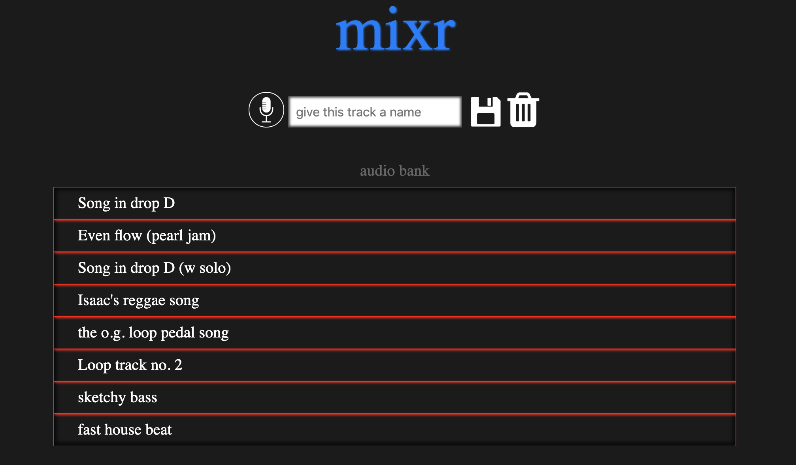
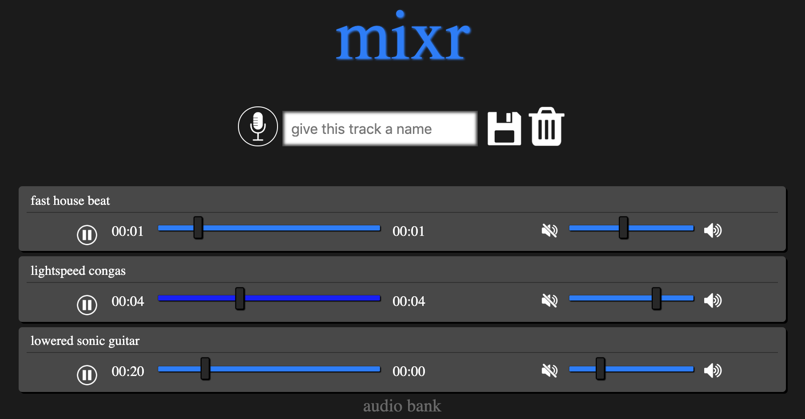
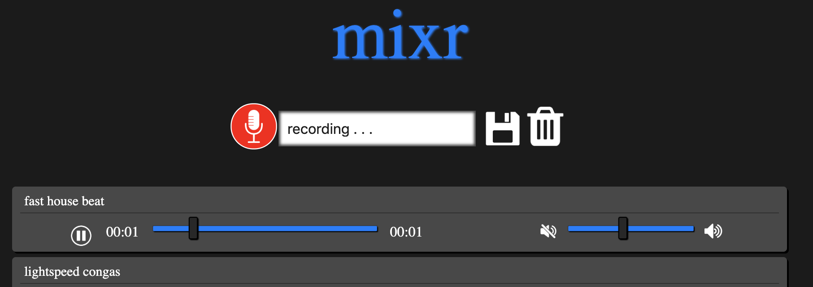

# MIXR

MIXR is a dynamic drum machine that lets artists import tracks and adjust audio playback by speeding up, slowing down, or changing the pitch of samples. Mixr allows you to loop and layer tracks that you record. 

MIXR is built with regular **JavaScript, CSS, and HTML5**.



## Features

   **Track Stacking**
   
- You can stack bb



   **Audio Bank**
   
- Compositions on MIXR aren't lost when a user navigates away from the page. 
- Audio files are base64 encoded and stored as strings in local storage, then retrieved for playback

```function _arrayBufferToFile(uri) {
    const arrayBuffer = _base64ToArrayBuffer(uri);
    const file = new File([arrayBuffer], "success");
    return file;
  }```


